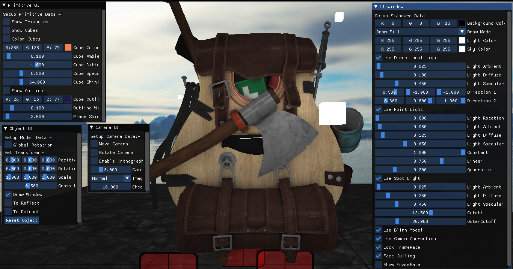
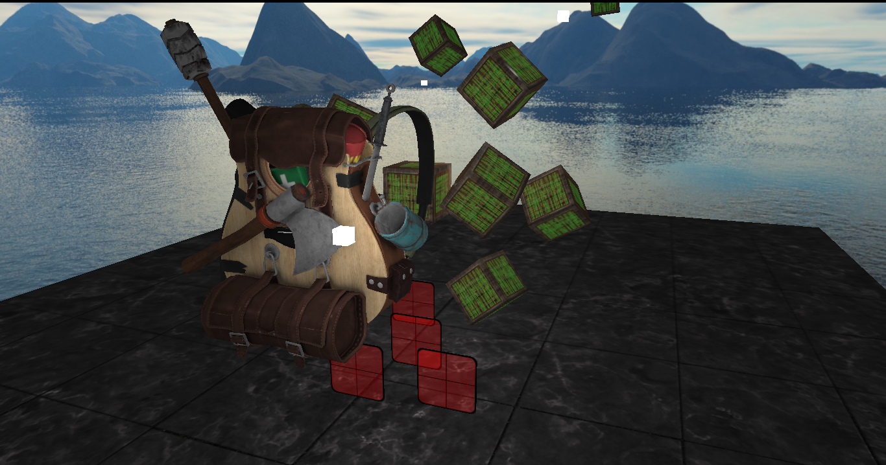
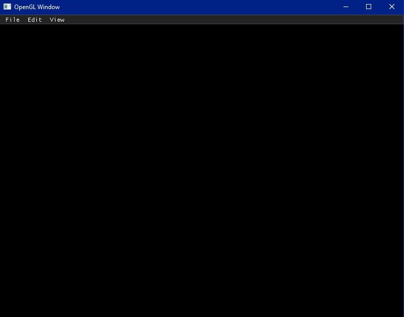
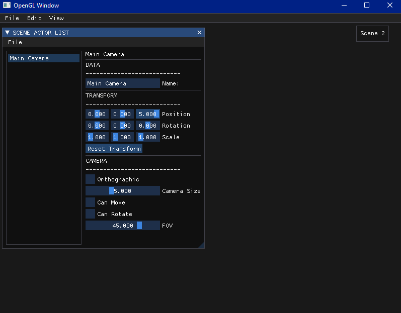
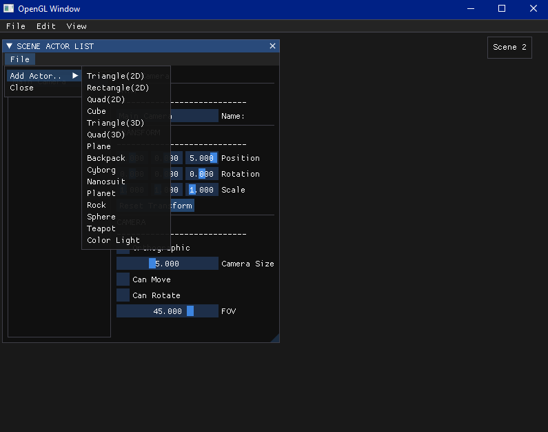
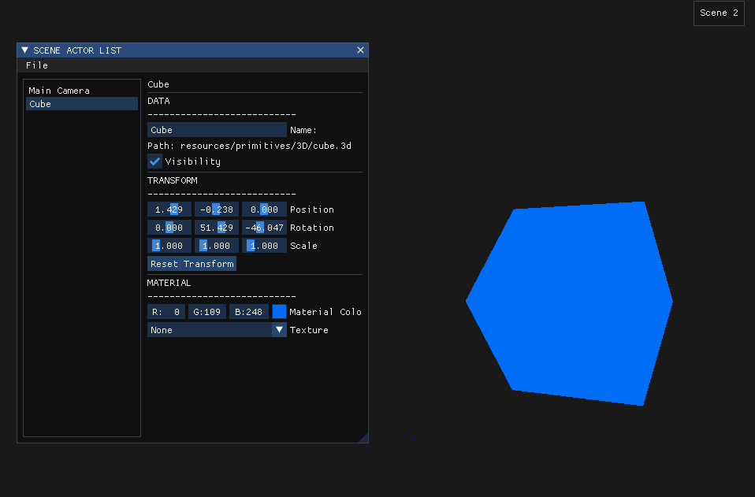
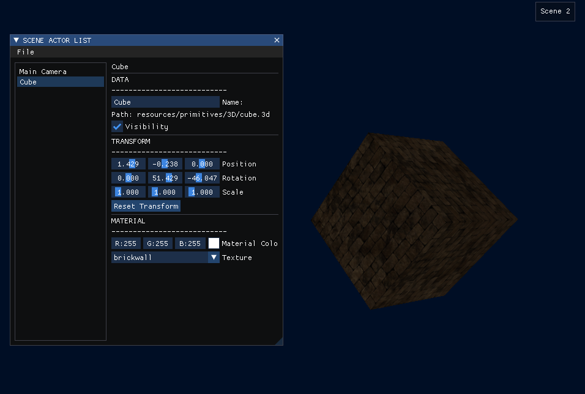
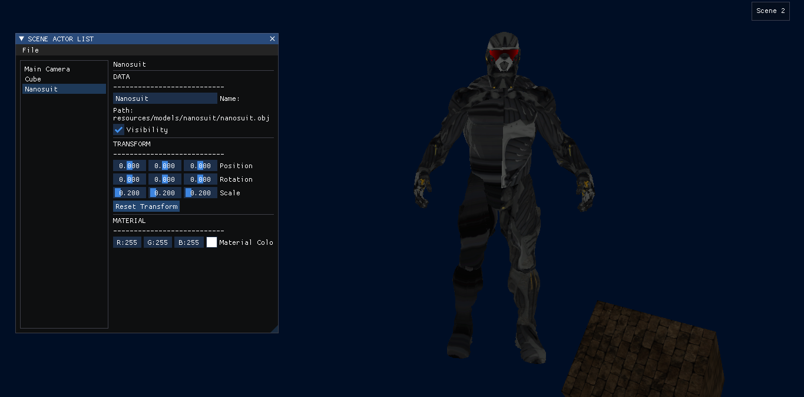

# 3D Renderer, OpenGL

This is a 3D Renderer written in C++ based on the OpenGL API.

## Features of the Renderer:-
- [x] Window Setup
- [x] Basic OpenGL
- [x] Basic Lighting
- [x] Loading 3D Models
- [x] UI with ImGUI
- [X] Scene System
- [ ] Advanced OpenGL
- [ ] Advanced Lighting
- [ ] PBR

## Screenshots

### Alpha Version of the Project

### Newly Implemented Scene System 
- Empty Window

- New Scene

- Adding New Actors to the Scene

- Changing properties such as Position, Rotation, Color, etc. via the UI

- Applying Template Textures to Objects

- Importing 3D Models to a Scene

